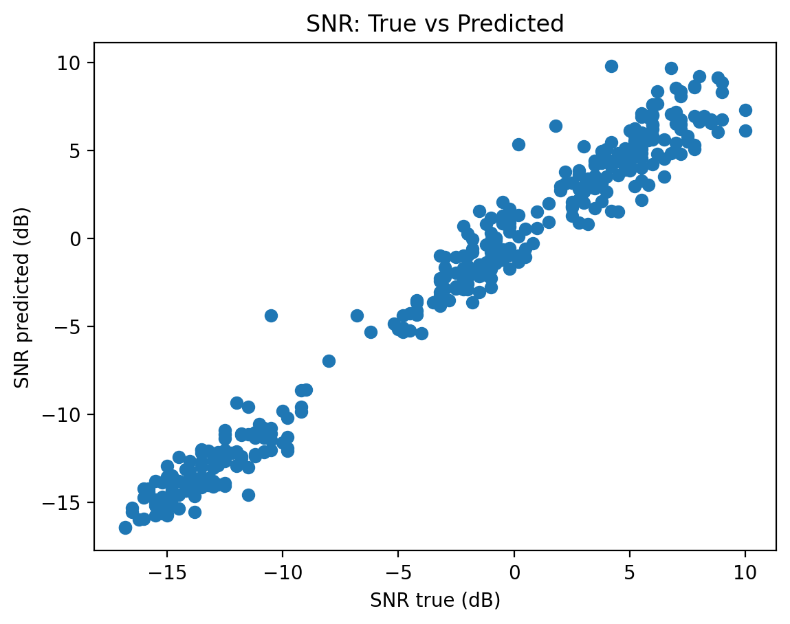
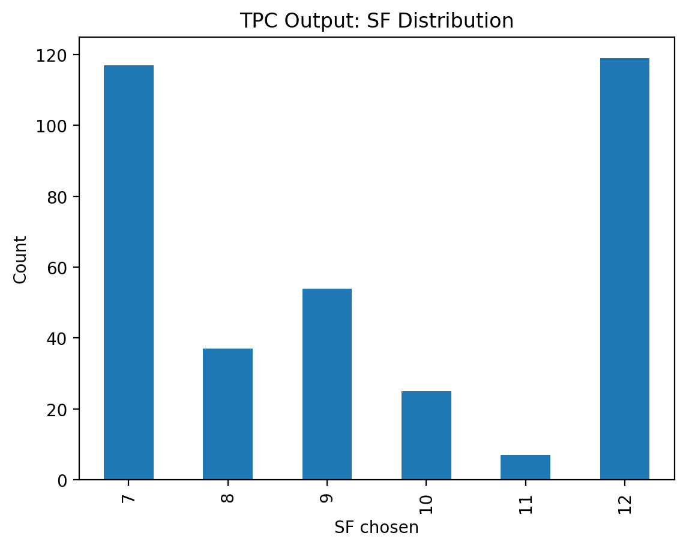
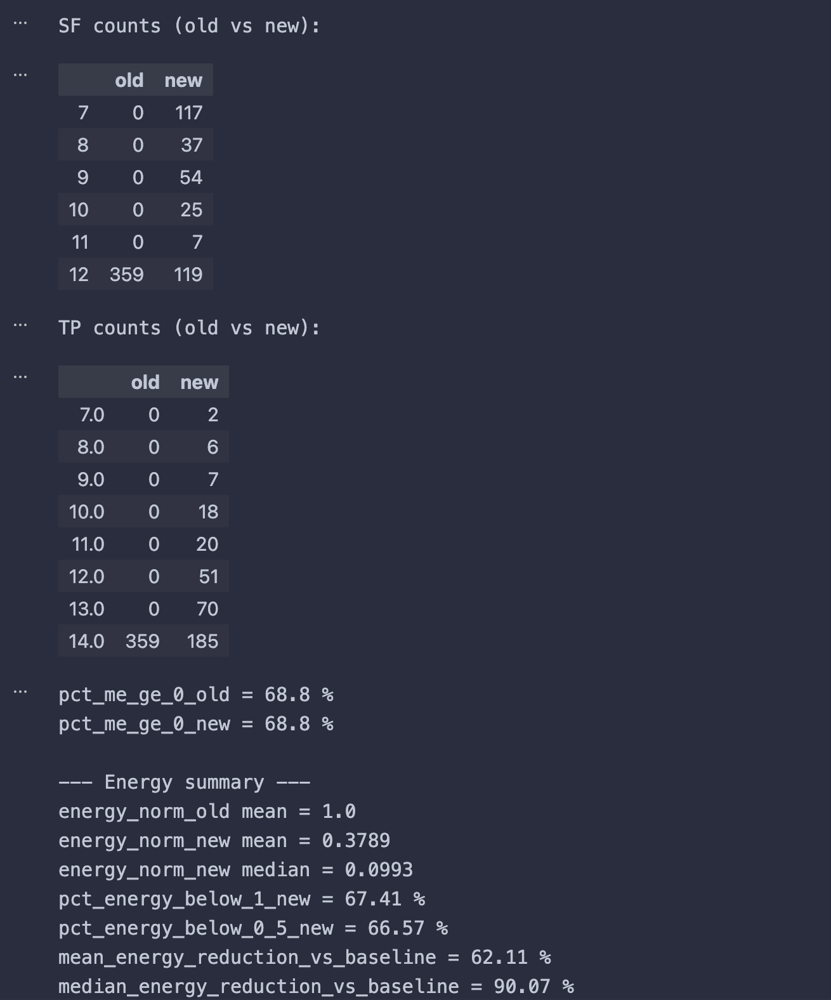

# بهینه‌سازی مصرف انرژی در شبکه‌های LoRaWAN با استفاده از یادگیری ماشین

این مخزن شامل پیاده‌سازی **یک Pipeline انتهابه‌انتها برای کاهش مصرف انرژی در شبکه‌های LoRaWAN** با تکیه بر **پیش‌بینی SNR و کنترل تطبیقی توان ارسال (ML-Assisted TPC)** است.

هدف پروژه، جایگزینی تصمیم‌گیری محافظه‌کارانه‌ی ADR استاندارد با یک رویکرد **داده‌محور، سریع و کم‌مصرف** می‌باشد.

---

## 📄 گزارش پژوهشی پروژه

گزارش علمی کامل پروژه (بیش از ۳۰ صفحه) که مبنای طراحی و پیاده‌سازی این کد بوده است:

📘 *[Energy_Optimization_IOT_Using ML.pdf](/Energy_Optimization_IOT_UsingML.pdf)*

در این گزارش:

* محدودیت‌های ADR استاندارد بررسی شده
* روش‌های ML و RL برای LoRaWAN مرور شده‌اند
* مفهوم **Margin Excess (Me)** و Trade-off انرژی/پایداری تحلیل شده
* چارچوب ML-Assisted TPC تشریح شده است

---

## 🧠 خلاصه کاری که انجام شده

Pipeline پیاده‌سازی‌شده شامل مراحل زیر است:

1. پیش‌پردازش داده‌های LoRaWAN
2. آموزش مدل‌های یادگیری ماشین برای پیش‌بینی SNR
3. اعمال الگوریتم **Transmission Power Control** مبتنی بر SNR پیش‌بینی‌شده
4. محاسبه مصرف انرژی نرمال‌شده
5. مقایسه کمی با **Baseline ثابت (ADR-like)**

---

## 📊 نتایج کلیدی (تحلیل نهایی)

### 🔹 کیفیت پیش‌بینی SNR

مقایسه SNR واقعی و پیش‌بینی‌شده توسط مدل ML:



---

### 🔹 رفتار تطبیقی الگوریتم (SF / TP)

توزیع پارامترهای انتخاب‌شده پس از اعمال TPC:



---

### 🔹 مقایسه نهایی با Baseline

تحلیل عددی و آماری خروجی الگوریتم پیشنهادی در مقایسه با پیکربندی baseline ثابت:



در این تحلیل:

* درصد نمونه‌های با **Me ≥ 0** افزایش یافته
* مصرف انرژی نرمال‌شده به‌طور معنی‌دار کاهش یافته
* بدون افت شدید در پایداری لینک

---

## 🗂️ ساختار پروژه

```
.
├── data/                داده‌های ورودی
├── models_trained/      مدل‌های آموزش‌دیده
├── notebooks/           اجرای نمایشی end-to-end
├── outputs/
│   ├── figures/         نمودارها و تحلیل‌ها
│   └── predictions/     خروجی‌های عددی (CSV)
├── src/
│   ├── run_pipeline.py
│   ├── tpc.py
│   ├── energy.py
│   ├── analyze_tpc_vs_baseline.py
│   └── ...
├── Energy_Optimization_IOT_Using ML.pdf
└── README.md
```

---

## ▶️ اجرای پروژه

```bash
pip install -r requirements.txt
python -m src.run_pipeline
python -m src.analyze_tpc_vs_baseline
```

---

## 🎓 جمع‌بندی

این پروژه نشان می‌دهد که:

* پیش‌بینی SNR با یادگیری ماشین
* امکان تصمیم‌گیری سریع‌تر و دقیق‌تر نسبت به ADR استاندارد را فراهم می‌کند
* و منجر به کاهش مصرف انرژی در شبکه‌های LoRaWAN می‌شود

پیاده‌سازی حاضر به‌گونه‌ای طراحی شده که:

* کاملاً قابل اجرا و بازتولید باشد
* ارتباط مستقیمی با گزارش پژوهشی داشته باشد
* برای بررسی مستقیم توسط استاد مناسب باشد
